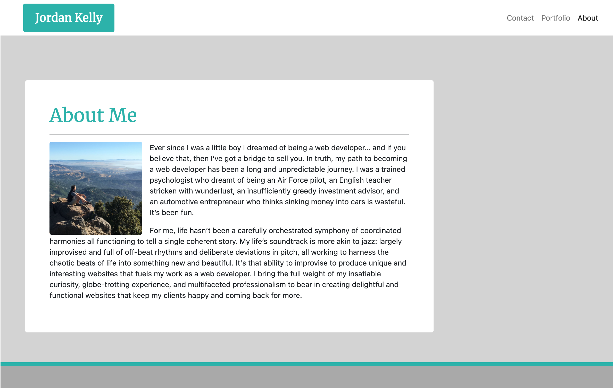
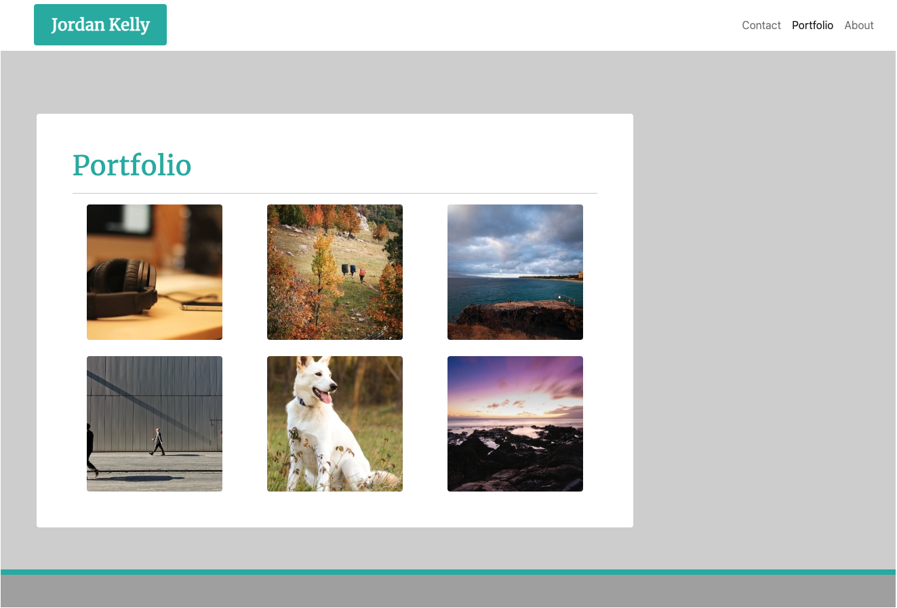
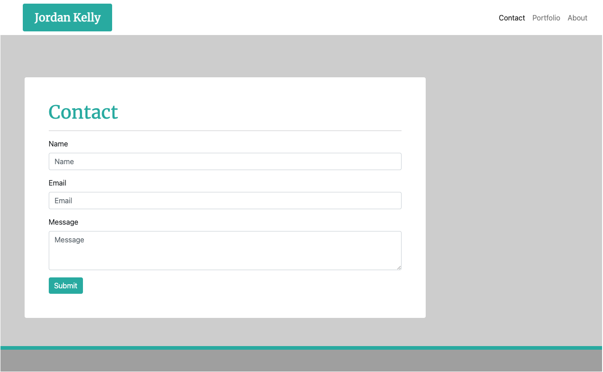

# Responsive Bootstrap Website

## Table of Contents
* [Project Summary](##project-summary)
* [Technologies Used](##technologies-used)
* [Example Code](##example-code)
* [How to Access](##how-to-access)
* [About Me](##about-me)
* [Screenshots](##screenshots)
---

## Project Summary
This is a responsive portfolio website designed using the Bootstrap framework. CSS styling is kept to a minimum in order to utilize styling from the Bootstrap framework. Special emphasis was given to ensure that all elements resize and reposition in response to various screen sizes.

## Technologies Used
* [Bootstrap CSS Framework](https://getbootstrap.com/)
* [HTML5](https://developer.mozilla.org/en-US/docs/Web/Guide/HTML/HTML5)
* [CSS3](https://developer.mozilla.org/en-US/docs/Archive/CSS3)

## Example Code
Responsive elements for all screen sizes.
```
<main class="container">
        <section class="row">
            <article class="col-xxl-8 col-xl-9 col-lg-10 col-md-11 col-sm-11 rounded">
```
A collapsable navigation menu and auto-adjusting margins.
```
<div class="collapse navbar-collapse" id="navbarNav">
    <ul class="navbar-nav ms-auto">
        <li class="nav-item">
        <a class="nav-link" href="contact.html">Contact</a>
        </li>
```
Image thumbnails that automatically line up and adjust to the screen.
```
<div class="col-xxl-4 col-xl-4 col-lg-4 col-md-6 col-sm-6 d-flex justify-content-evenly">
    <a href="#">
    <!-- Fluid container, rounded corners, temporary placeholding image -->
    </a>
</div>
```

## How to Access
[Jordan's Responsive Portfolio Website](https://profjjk.github.io/responsive-portfolio/)

## About Me
* [LinkedIn](https://www.linkedin.com/in/jordan-kelly-3934a597/)
* [GitHub](https://github.com/profjjk)

## Screenshots


